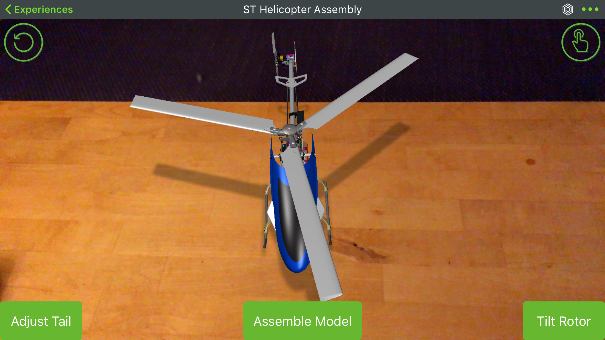
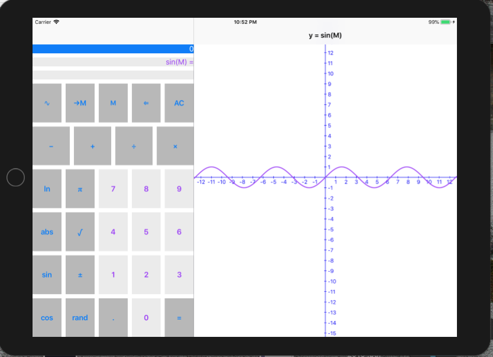
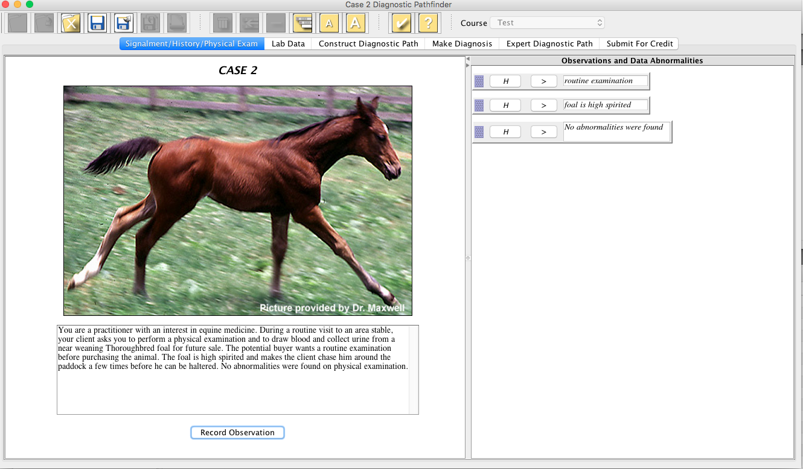
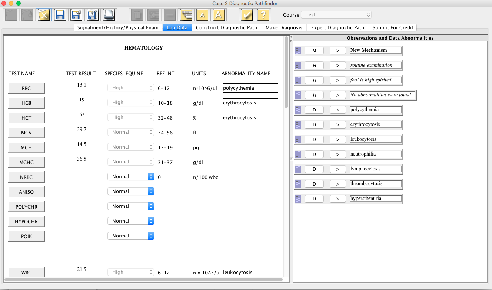
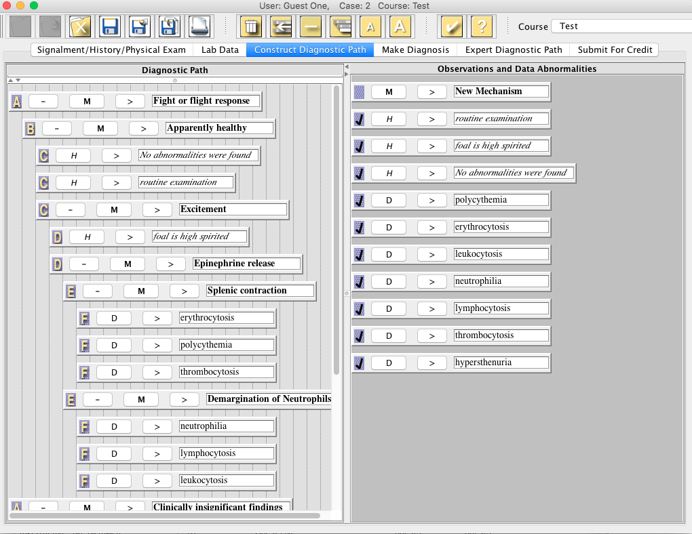
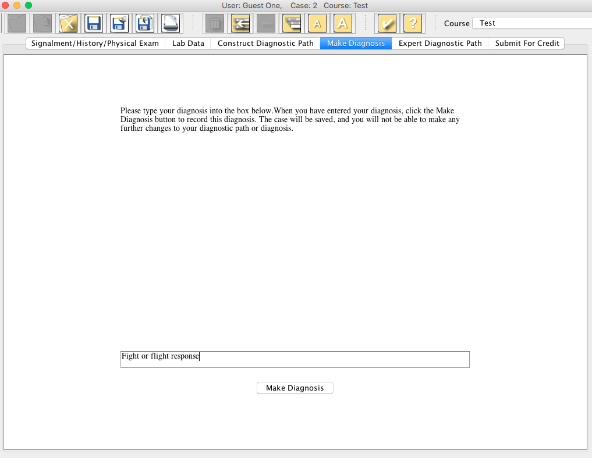
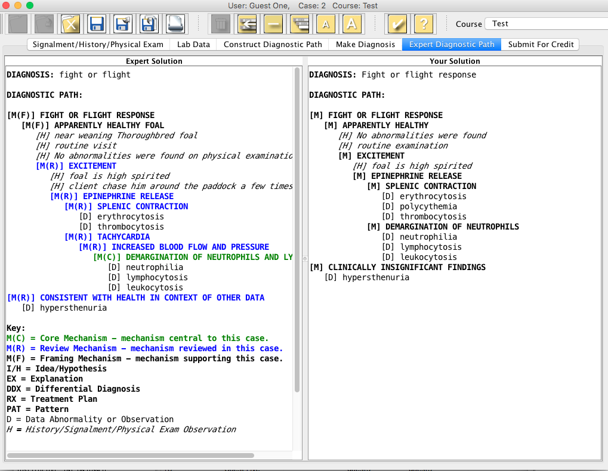
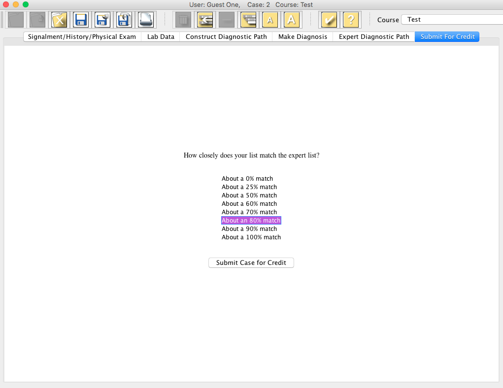

## ThingWorx View 

This app enables users to see augmented reality Experiences that are developed with the ThingWorx Studio authoring tool.  Experiences are able to display rich 3D content, as well as connect to live IoT data.  It is available for iOS, Android, Windows Surface, and HoloLens.  I have been involved in this project since its inception in January, 2016.

*Spatial tracking Experience using ARKit in ThingWorx View for iOS*

Learn more about [ThingWorx Studio from PTC](https://www.ptc.com/en/products/augmented-reality/thingworx-studio)

Download for your device today!
* [ThingWorx View for iOS](https://itunes.apple.com/us/app/thingworx-view/id1076700285?mt=8)
* [ThingWorx View for Android](https://play.google.com/store/apps/details?id=com.ptc.vuforiaview&hl=en_US)
* [ThingWorx View for Windows](https://www.microsoft.com/en-us/store/p/thingworx-view/9nblggh54wk8?activetab=pivot%3aoverviewtab)
* [ThingWorx View for HoloLens](https://www.microsoft.com/en-us/store/p/thingworx-view-for-hololens/9nblggh555tt?activetab=pivot%3aoverviewtab)

## iOS Graphing Calculator

I wrote this app as "homework" while working through the Stanford University course [Developing iOS 10 Apps with Swift](https://itunes.apple.com/us/course/developing-ios-10-apps-with-swift/id1198467120).

*Graphing the sine wave*

## Diagnostic Pathfinder

As part of the Biological Informatics Research Group and Iowa State University and Virginia Tech, I was the sole software engineer on a team creating the Diagnostic Pathfinder, a tool to help students learn clinical pathology.  I was architect, database administrator, developer, tester, and tech support all in one!  This tool was a gated, case-based study tool.  Students were required to complete each phase before they could move on to the next step. The class had 93 case studies that the students worked through.

*Students select relevant information from the case history*

*Students review all the laboratory data, and denote the medical terminology for abnormalities*

*All of the history and abnormalities shown in the right must be dragged and dropped in an outline form on the left, with mechanisms explaining what caused them inserted above*

*After completing their diagnostic path, students provide a succinct diagnosis*

*The professor's diagnostic path is displayed on the left and the student's on the right, so students can understand the expert's thinking about the case*

*Students provide a self-evaluation before submitting the case for credit*

